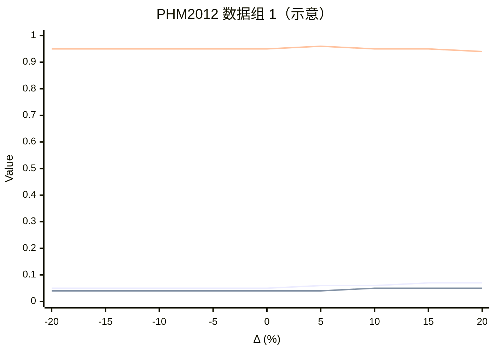
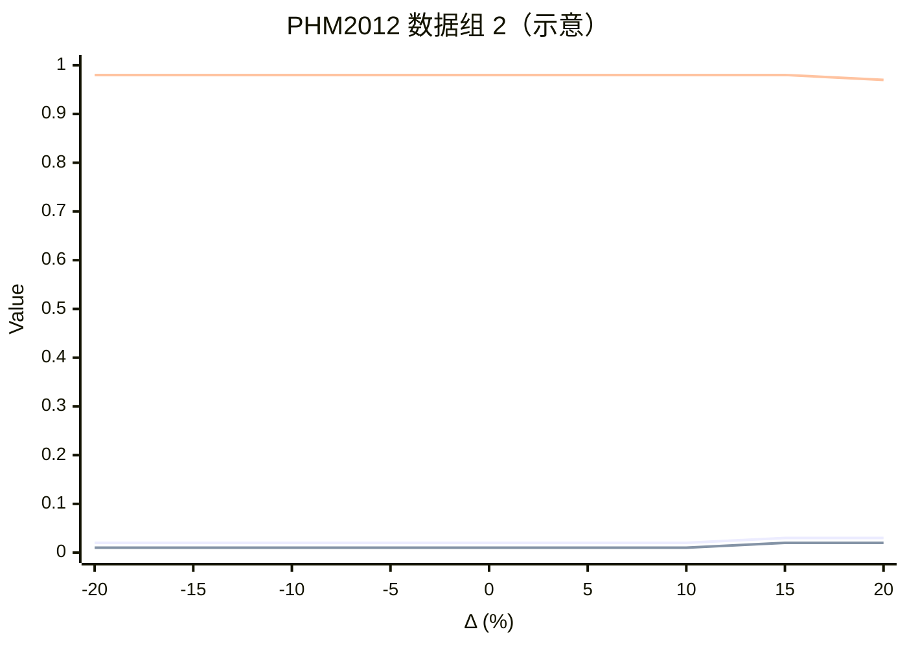

# PHM2012 测试 TSP 敏感性实验

## 1. 实验目的

先得到待评估方法预测出的测试 TSP，记为：

$$
\mathrm{TSP}_0
$$

然后人为构造不同的测试 TSP，用于分析 TSP 变化对模型性能的影响。

## 2. 测试 TSP 的构造方法

不同的测试 TSP 定义为：

$$
\mathrm{TSP} = \mathrm{TSP}_0 + \Delta
$$

其中：

$$
\Delta \in
\{-20\%,-15\%,-10\%,-5\%,0,+5\%,+10\%,+15\%,+20\%\}
$$

具体实验时，可根据数据长度选择以下一种方式：

1. 按数据长度的百分比设置 $\Delta$；
2. 按固定点数设置 $\Delta$，例如以 10 个数据点为一个变化单位。

> 为便于比较，同一组实验应始终使用同一种 $\Delta$ 设置方式。

## 3. 数据范围

- 从 **PHM2012** 数据集中选择两组数据；
- 不需要使用 ALT 实验数据；
- 两组数据分别绘制一张性能对比图。

## 4. 评价指标

每个 TSP（或 $\Delta$）取值均计算以下指标：

- RMSE；
- MAE；
- $R^2$。

## 5. 结果记录表

### PHM2012 数据组 1

| $\Delta$ | 测试 TSP | RMSE | MAE | $R^2$ |
|---:|---:|---:|---:|---:|
| -20% | 待填写 | 待填写 | 待填写 | 待填写 |
| -15% | 待填写 | 待填写 | 待填写 | 待填写 |
| -10% | 待填写 | 待填写 | 待填写 | 待填写 |
| -5%  | 待填写 | 待填写 | 待填写 | 待填写 |
| 0    | $\mathrm{TSP}_0$ | 待填写 | 待填写 | 待填写 |
| +5%  | 待填写 | 待填写 | 待填写 | 待填写 |
| +10% | 待填写 | 待填写 | 待填写 | 待填写 |
| +15% | 待填写 | 待填写 | 待填写 | 待填写 |
| +20% | 待填写 | 待填写 | 待填写 | 待填写 |

### PHM2012 数据组 2

| $\Delta$ | 测试 TSP | RMSE | MAE | $R^2$ |
|---:|---:|---:|---:|---:|
| -20% | 待填写 | 待填写 | 待填写 | 待填写 |
| -15% | 待填写 | 待填写 | 待填写 | 待填写 |
| -10% | 待填写 | 待填写 | 待填写 | 待填写 |
| -5%  | 待填写 | 待填写 | 待填写 | 待填写 |
| 0    | $\mathrm{TSP}_0$ | 待填写 | 待填写 | 待填写 |
| +5%  | 待填写 | 待填写 | 待填写 | 待填写 |
| +10% | 待填写 | 待填写 | 待填写 | 待填写 |
| +15% | 待填写 | 待填写 | 待填写 | 待填写 |
| +20% | 待填写 | 待填写 | 待填写 | 待填写 |

## 6. 绘图格式

- 横坐标：测试 TSP 或 $\Delta$；
- 纵坐标：指标值（Value）；
- 每张图包含 RMSE、MAE 和 $R^2$ 三条曲线；
- 两组 PHM2012 数据分别绘图，并采用相同的坐标范围和图例格式。

### 排版示意

> 以下数值仅用于还原截图中的双图排版和曲线形式，不代表真实实验结果。  
> Mermaid 图中三条线的顺序依次为 RMSE、MAE、$R^2$。

#### PHM2012 数据组 1

#### PHM2012 数据组 2

## 7. 最终输出要求

1. 给出两组 PHM2012 数据各自的 $\mathrm{TSP}_0$；
2. 给出各个 $\Delta$ 对应的实际测试 TSP；
3. 提供完整的 RMSE、MAE、$R^2$ 结果表；
4. 输出两张格式一致的折线图；
5. 分析模型对 TSP 变化是否敏感，以及性能最稳定的 TSP 区间。

